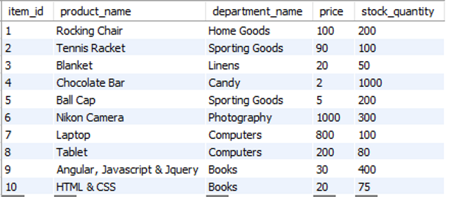
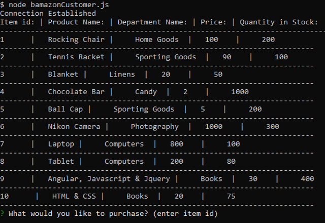
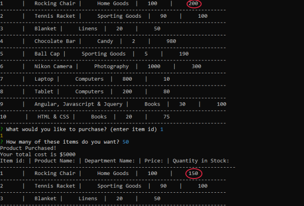
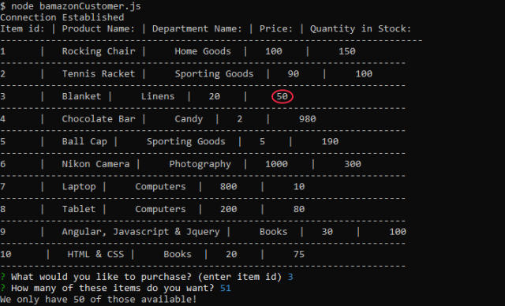

# Bamazon
This is a command line program whereby the user can purchase various products in assorted amounts, and the database will be updated according to how many items were purchased, and how many items there were in stock at the time of purchase.

## Screenshots

The initial database values

Displaying the items to purchase

Here, we see the product quantity updated, as well as a total cost calculation

If the user enters a quantity higher than the quantity in stock, we let them know

